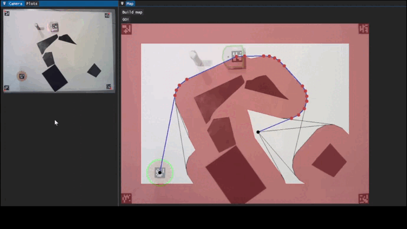

# Mobile Robotics Project

For the EPFL course MICRO-452 Basics of mobile robotics, project from Maria Cherchouri, Mathieu Schertenleib, Jacques Bénand and Théo Maetz, using
the [Thymio](https://www.thymio.org/) robot.

See the [full report](report.ipynb) and the [videos](videos).

